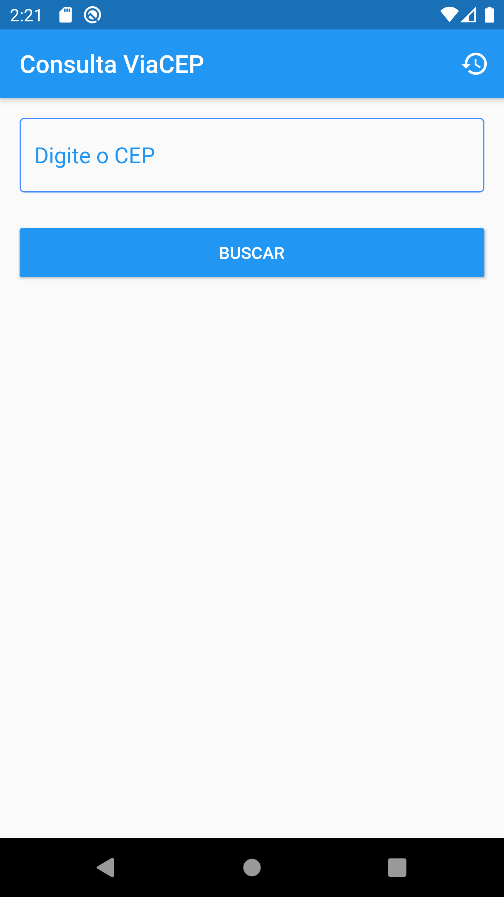
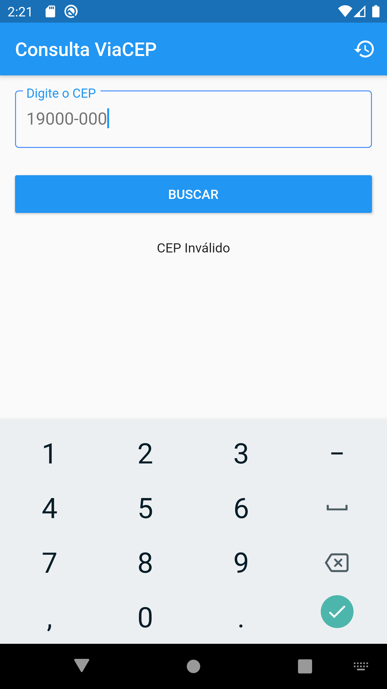
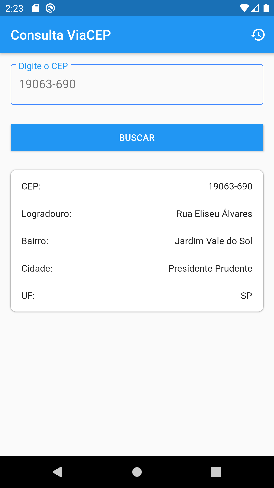
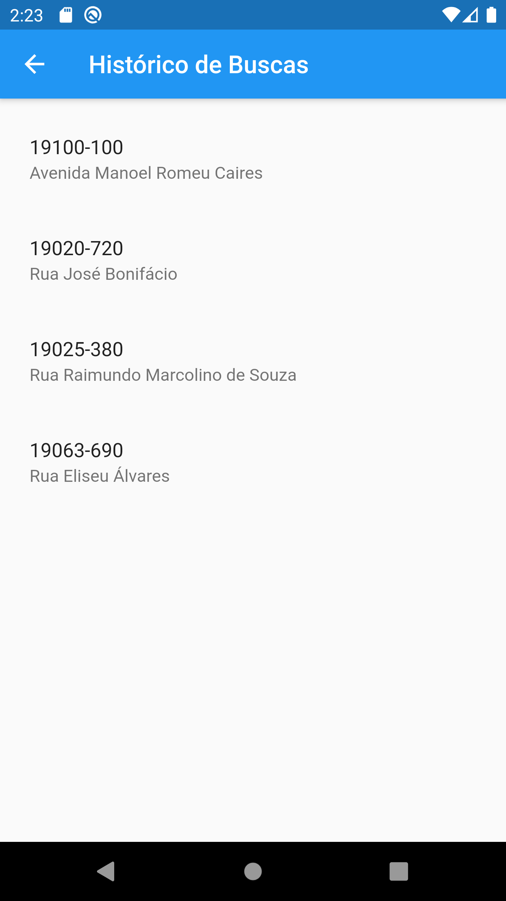

# Busca Cep

Um app para fazer rápidas consultas,e verificar seu histórico de buscas

## Desenvolvimento

Projeto desenvolvido em **Flutter**, utilizando:

- [firebase_core](https://pub.dev/packages/firebase_core)
- [cloud_firestore](https://pub.dev/packages/cloud_firestore)
- [http](https://pub.dev/packages/http)
- [mask_text_input_formatter](https://pub.dev/packages/mask_text_input_formatter)

## Demonstração

### Home

### CEP Inválido

### Busca

### Histórico

## Copyright E Licença

Copyright 2021 Johnny Freire.
